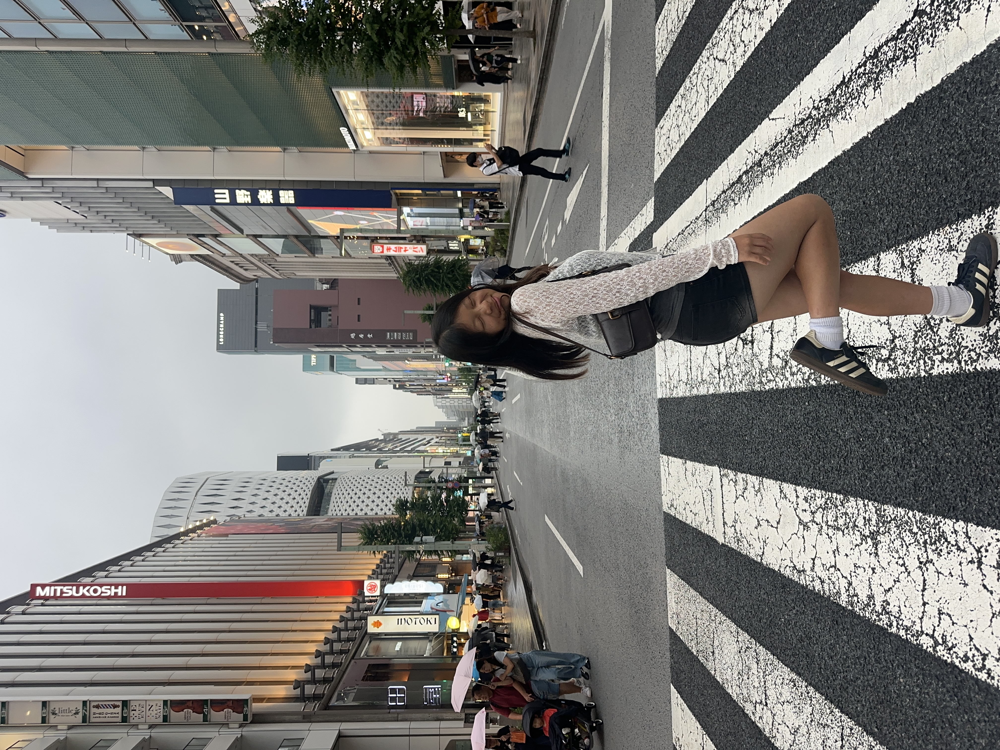

# travel-dairies
<!DOCTYPE html>
<html>
<head>
Elysse’s Travel Diary</title>
</head>
<body>
<h1> Where I’ve Travelled to in the Past Year!! </h1>

 Traveling is one of my favorite things to do and I’ve been to a lot of places in the past few years! This past year has been one of the craziest and funnest years ever. I want to share with you about some of the places I’ve been to. 

<h2> Spain! </h2>

 In November 2025, I went to Spain! This was one of my most favorite trips! I went to Madrid, Barcelona, and smaller towns like Toledo and Segovia over the course of a week! I love everything about this country and definetly want to visit again! I don't have any pictures sadly 

<h3> Mexico! </h3>

 I went to Mexico City over winter break and it was sososo fun! I go to go to many amazing places within Mexico city including Teoticuahan ad MUNAL! My favorite times were definetly going shopping for vintage clothes, eating lots of tacos, and trying to speak to the locals using my limited spanish I don't have that many images sadly ;(

<h4> Switerland, Italy and France! </h4>

 I went to switzerland, italy and france over spring break, this was such a fun and tiring trip because we went to so many places in one week! Switzerland has been one of the places where I've always dreamed of traveling to amd now I can say I've been. It's one of the most beautiful places on earth. I stayed in Zurich and went to other cities like Lucerne and Bern! I didn't get to go to places like Interlaken and Lauternbruan though... Since we rented a car we drove to Colmar, France for a day. genuinely one of the cutest cities in the country, and for some reason we took a train to Lake Como in italy which is also gorgeous. Anyway it was such a fun week. 

<h5> Taiwan and Japan! </h5>

 Guess what...I went to more places..this time I travelled to Asia for 3 weeks! I went to Taiwan where I visited my family and got to go on many solo adventures using the subway lol. I went to taipei and I went to places like Taipei 101, xinmending, elephant mountain, tamsui, etc. Everyday was full of adventure and was my favorite times of this summer. I also went to Japan specially Tokyo! I did lots of shopping, went to Tokyo Disney, ate lots and lots of food and even bought a new camera! Anyway heres a picture of me in Japan! 

<a href="https://tenor.com/view/rat-dumb-silly-hamster-happy-rat-gif-9734756581361076180"> well thanks for reading! </a>
</body>
</html>
